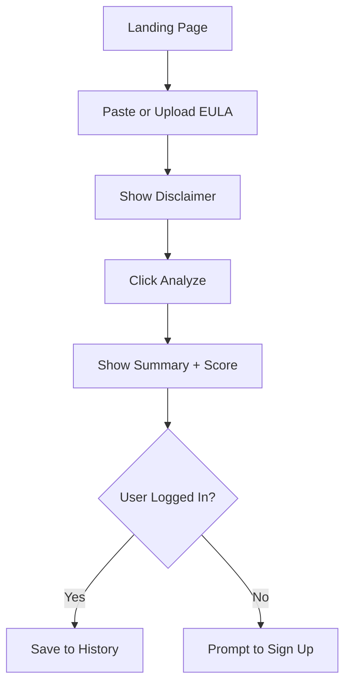

# User Flow Documentation

```mermaid
graph TD
  A[Landing Page] --> B[Paste or Upload EULA]
  B --> C[Show Disclaimer]
  C --> D[Click Analyze]
  D --> E[Show Summary + Score]
  E --> F{User Logged In?}
  F -- Yes --> G[Save to History]
  F -- No --> H[Prompt to Sign Up]
```

- Minimal steps
- Optional sign-in
- Result always visible